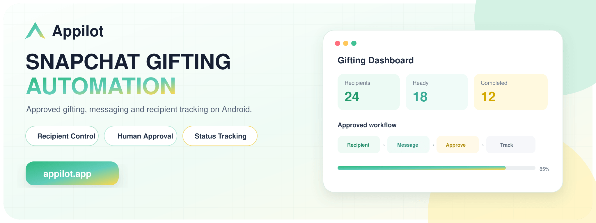
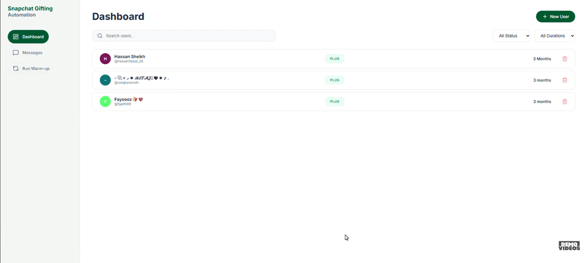
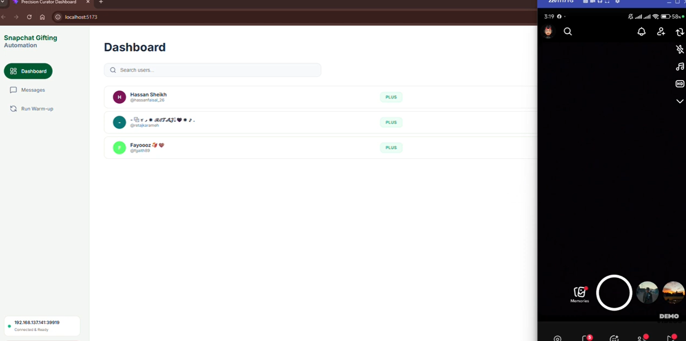
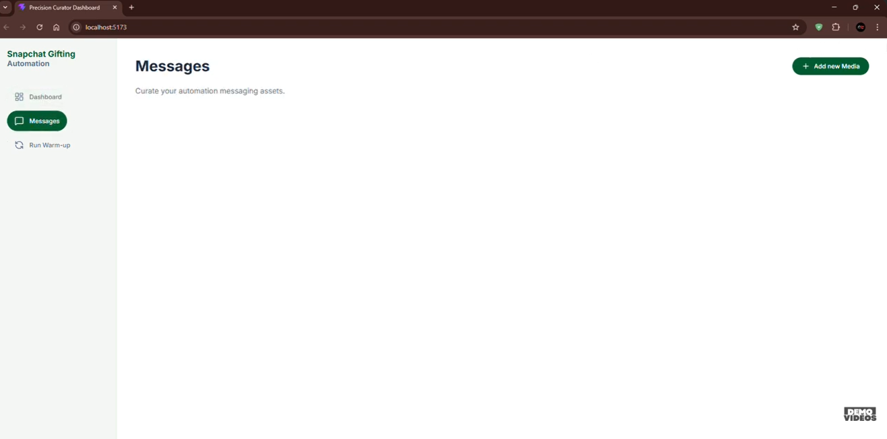
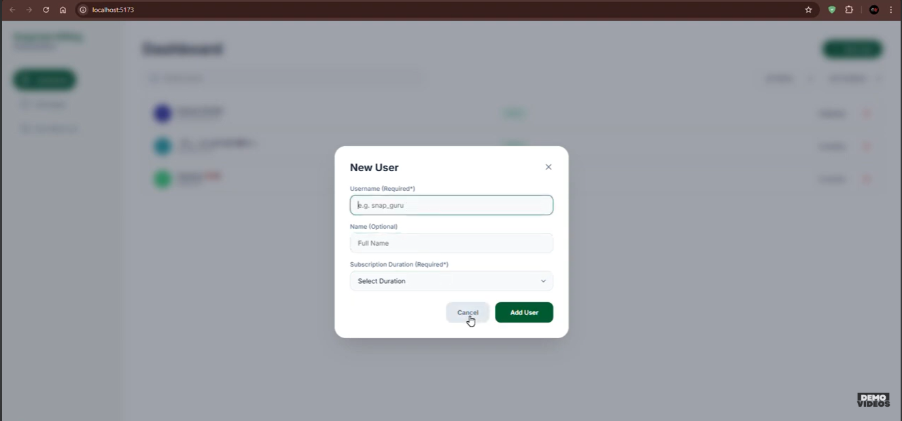

# Snapchat Gifting Automation by Appilot

**An Appilot product showcase for operator-approved Snapchat+ gifting, recipient management, message delivery and status tracking on an authorized Android device.**

[](https://www.appilot.app/) [](https://youtu.be/sog5S1f2hfY)




## Demo Video

[](https://youtu.be/sog5S1f2hfY)

**Watch on YouTube:** https://youtu.be/sog5S1f2hfY

## Overview

This workflow coordinates an approved Snapchat gifting process on a real Android device. Operators can maintain a recipient list, configure subscription duration, manage approved Arabic messages and media, run readiness checks, and track completion from a centralized dashboard.

Financial approval and final confirmation must remain under the authorized account owner’s control. This public repository contains product documentation and visual assets only; production code, credentials, payment details, device sessions and recipient data are excluded.

## Core Capabilities

| Capability | What it provides |
|---|---|
| **Recipient dashboard** | Organizes approved users and gifting durations. |
| **Friend-request workflow** | Tracks recipient readiness before an approved gift is sent. |
| **Message assets** | Manages approved Arabic messages and image attachments. |
| **Warm-up checks** | Confirms device and application readiness before execution. |
| **Status tracking** | Records pending, ready, completed and exception states. |
| **Database synchronization** | Keeps operational status aligned with the dashboard. |
| **Operator approval** | Preserves human confirmation for financial or sensitive steps. |
| **Custom deployment** | Adapts fields, integrations and reporting to the client process. |

## Workflow

1. Add an approved recipient and intended subscription duration.
2. Validate account, device and relationship readiness.
3. Select approved message and image assets.
4. Present gifting details to the authorized operator for confirmation.
5. Execute the supported mobile workflow on the connected Android device.
6. Record success or exception status and synchronize the dashboard.

## Screenshots

<table align="center"><tr><td align="center" width="50%"><br><b>Recipient and duration dashboard</b></td><td align="center" width="50%"><br><b>Dashboard with connected Android device</b></td></tr><tr><td align="center" width="50%"><br><b>Approved message and media workspace</b></td><td align="center" width="50%"><br><b>New recipient configuration</b></td></tr></table>

## Repository Contents

```text
snapchat-gifting-automation/
├── README.md
├── ARCHITECTURE.md
├── DEMO.md
├── REPOSITORY-SETUP.md
├── RESPONSIBLE-USE.md
├── repo-metadata.json
├── LICENSE
├── .gitignore
└── assets/
    ├── banner.png
    ├── banner.svg
    └── screenshots/
```

## Build a Controlled Snapchat Workflow

Appilot can design recipient management, approvals, Android execution and reporting around an authorized gifting operation.

**[Discuss Your Project With Appilot](https://www.appilot.app/contact)**

[Visit Appilot](https://www.appilot.app/) · [Watch the Demo](https://youtu.be/sog5S1f2hfY)

